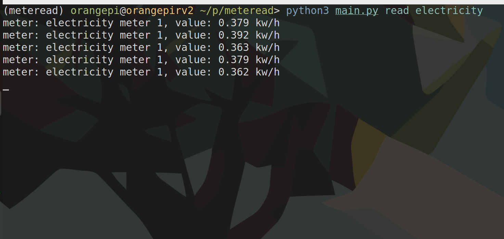

# Meteread

A Python utility for reading meter values from various types of utility meters including water, electricity, and gas meters with configurable data readers.

## Overview

Meteread is a command-line application that provides meter readings from different utility meters. It features a modular architecture with separate components for meters, data readers, and processors, allowing for flexible configuration of how meter data is read and processed. The project uses an object-oriented design with abstract base classes for meters, readers, and processors.

### Screenshot


## Features

- **Generic Meter**: Flexible meter configuration for any utility type (water, electricity, gas)
- **Modular Reader Architecture**: Configurable data readers for different reading behaviors
- **Processor Support**: Data processors for transforming and formatting meter readings
- **DSMR Support**: Real electricity meter reading via DSMR protocol
- **Delay and Random Readers**: Simulated readings with configurable delays
- **Callable Pattern**: Each meter implements Python's callable protocol for continuous reading
- **Command Line Interface**: Easy-to-use CLI built with Typer
- **Extensible Design**: Abstract base classes allow for easy addition of new readers and processors

## Meter Types

- **GenericMeter**: Configurable meter that combines a reader and processor for any utility type

## Reader Types

- **RandomReader**: Generates random values for testing and simulation
- **ZeroReader**: Returns zero values (useful for testing)
- **DelayReader**: Wraps another reader and adds configurable delays
- **DSMRv5Reader**: Reads real electricity data from DSMR-compatible smart meters

## Processor Types

- **PassProcessor**: Passes through the value with configurable unit and serial number
- **NoneProcessor**: Returns None values (useful for testing or placeholder configurations)

## Installation

1. Clone the repository:
    ```bash
    git clone https://github.com/pashamray/meteread.git
    cd meteread
    ```

2. Install using uv (recommended):
    ```bash
    uv install
    ```

   Or using pip:
    ```bash
    pip install -e .
    ```

## Usage

Run the application using Python:

```bash
python main.py read <meter_type>
```

### Available Commands

#### Read Meter Values
```bash
python main.py read water       # Read water meter (random values with 1s delay)
python main.py read electricity # Read electricity meter (DSMR from /dev/ttyUSB0)
python main.py read gas         # Read gas meter (zero values with 1s delay)
```

Example output:
```
meter: cold water, value: 3.45 m³
meter: cold water, value: 2.78 m³
meter: cold water, value: 4.12 m³
...
```

#### Configuration (Coming Soon)
```bash
python main.py config
```
*Note: Configuration command is not yet implemented*

## Project Structure

```
meteread/
├── main.py                    # Main application entry point
├── README.md                  # This file
├── pyproject.toml            # Project configuration and dependencies
├── uv.lock                   # Lock file for uv package manager
├── meter/                    # Meter module
│   ├── __init__.py           # Module initialization
│   ├── AbstractMeter.py      # Abstract base class for all meters
│   └── GenericMeter.py       # Generic meter implementation
├── processor/                # Processor module
│   ├── __init__.py           # Module initialization
│   ├── AbstractProcessor.py  # Abstract base class for all processors
│   ├── NoneProcessor.py      # None value processor
│   └── PassProcessor.py      # Pass-through processor
└── reader/                   # Reader module
    ├── __init__.py           # Module initialization
    ├── AbstractReader.py     # Abstract base class for all readers
    ├── DelayReader.py        # Adds delays to reader output
    ├── DSMRv5Reader.py       # DSMR protocol reader for smart meters
    ├── RandomReader.py       # Random value generator reader
    └── ZeroReader.py         # Zero value reader
```

## Architecture

The project follows a clean architecture pattern with three main abstractions:

### Meters
- **AbstractMeter**: Base class implementing the callable protocol
- **GenericMeter**: Flexible meter that combines a reader and processor for any utility type

### Readers
- **AbstractReader**: Base class for data reading strategies
- **Concrete Readers**: Different implementations for various data sources and behaviors

### Processors
- **AbstractProcessor**: Base class for data processing strategies
- **Concrete Processors**: Different implementations for transforming reader output

Each meter is configured with a reader and a processor. The reader determines how the raw data is generated or read, while the processor transforms the data into the final output format. This allows for flexible combinations like:
- Water meter with random data, delays, and pass-through processing
- Electricity meter with real DSMR data and custom processing
- Gas meter with zero values for testing

## Dependencies

- **typer**: Command-line interface framework
- **dsmr-parser**: DSMR protocol parsing for Dutch smart meters
- **Python 3.13+**: Required Python version

## Development

### Adding New Meter Types

1. Create a new class inheriting from `AbstractMeter`
2. Implement any required custom behavior
3. Configure with the appropriate reader and processor in `main.py`

### Adding New Readers

1. Create a new class inheriting from `AbstractReader`
2. Implement the `__next__()` method to return float values
3. Add any required initialization parameters

### Adding New Processors

1. Create a new class inheriting from `AbstractProcessor`
2. Implement the `__call__()` method to yield processed data dictionaries
3. Add any required initialization parameters

### Example: Custom Reader

```python
from reader.AbstractReader import AbstractReader

class CustomReader(AbstractReader):
    def __init__(self, custom_param):
        self.custom_param = custom_param

    def __next__(self) -> float:
        # Your custom logic here
        return 1.0 # sample value
```

### Example: Custom Processor

```python
from typing import Any, Generator
from processor.AbstractProcessor import AbstractProcessor

class CustomProcessor(AbstractProcessor):
    def __init__(self, sn: str = 'None', unit: str = 'None'):
        super().__init__(sn, unit)

    def __call__(self, data) -> Generator[dict[str, str | None], Any, None]:
        yield {
            'value': data * 2,  # Custom transformation
            'unit': self.unit,
            'sn': self.sn,
        }
```

## License

See LICENSE file for details.

